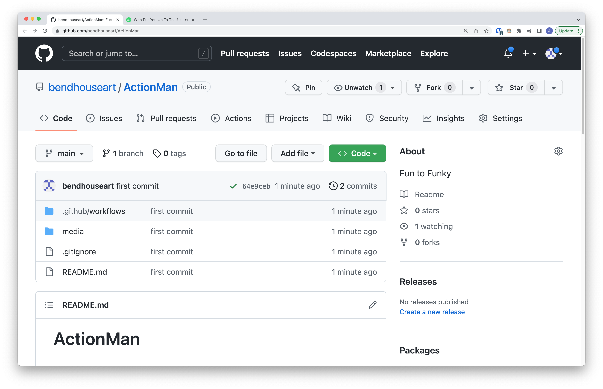
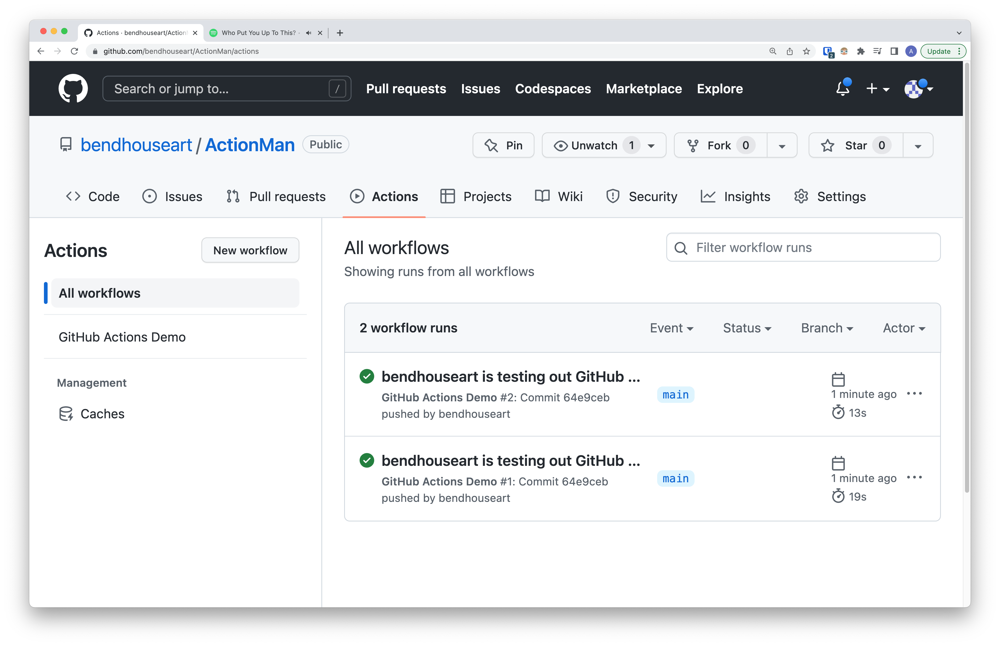

# ActionMan
Fun to Funky

## Why?

0) Why not?
1) It's free
2) Testing good
3) Proof of work
4) You enjoy working on other peoples computers

## Setting up Actions

Read below to get started with setting up a repository to use actions. Some simple boiler plate 
has been included below to help you get started. Feel free to improvise and not use it though, I'm a 
README not a cop.

<details>
Create a git repository, then make a folder with a file in it.

```bash
mkdir -p .github/workflows
touch .github/workflows/github-actions-demo.yaml
```

Paste this into the file you just made:

```yaml
name: GitHub Actions Demo
run-name: ${{ github.actor }} is testing out GitHub Actions 🚀
on: [push]
jobs:
  Explore-GitHub-Actions:
    runs-on: ubuntu-latest
    steps:
      - run: echo "🎉 The job was automatically triggered by a ${{ github.event_name }} event."
      - run: echo "🐧 This job is now running on a ${{ runner.os }} server hosted by GitHub!"
      - run: echo "🔎 The name of your branch is ${{ github.ref }} and your repository is ${{ github.repository }}."
      - name: Check out repository code
        uses: actions/checkout@v3
      - run: echo "💡 The ${{ github.repository }} repository has been cloned to the runner."
      - run: echo "🖥️ The workflow is now ready to test your code on the runner."
      - name: List files in the repository
        run: |
          ls ${{ github.workspace }}
      - run: echo "🍏 This job's status is ${{ job.status }}."
```

Save those changes to `github-actions-demo.yaml` and then commit and push changes:

```bash
# this is best practice, don't let others tell you otherwise
git add --all
git commit -m "setup actions"
git push origin main
```

Now navigate to you repository on github and click on the `actions` tab.





Congrats, you have actions.

**Alternatively**, [fork this repository](https://github.com/bendhouseart/ActionMan/fork) or visit the well put together documentation on [github](https://docs.github.com/en/actions/quickstart).

</details>

## Oh please, mon dieu! Yaml? Github syntax?

I don't carry a torch for Github nor it's Actions syntax, you don't have to either. It's often desirable to 
wrap or define "Action" steps independently from the workflow files in `.github/workflows`.

There are infinitely many ways of doing this, but for this short demo we will focus on using Make.

<details>

</details>

## Acting Out

For this demo we're going to demonstrate some of the steps required to act on a different 
github repository.

To complete this exercise you will need to:

- Create another github repository on the same account/user as the one you previously made
- Generate a [Fine-grained personal access token](https://docs.github.com/en/authentication/keeping-your-account-and-data-secure/creating-a-personal-access-token#fine-grained-personal-access-tokens) with the appropriate permissions
- Checkout the newly created repository in Actions
- Push changes using Actions and the Token created in step 2


<details>

</details>